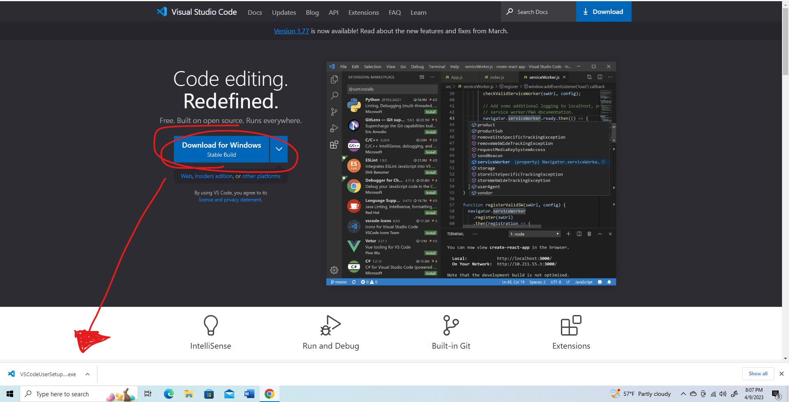
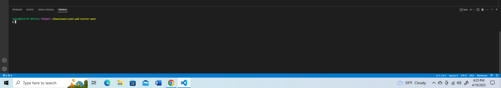
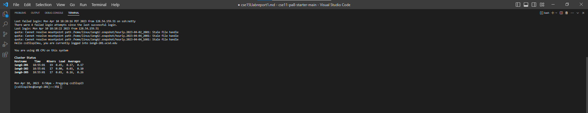
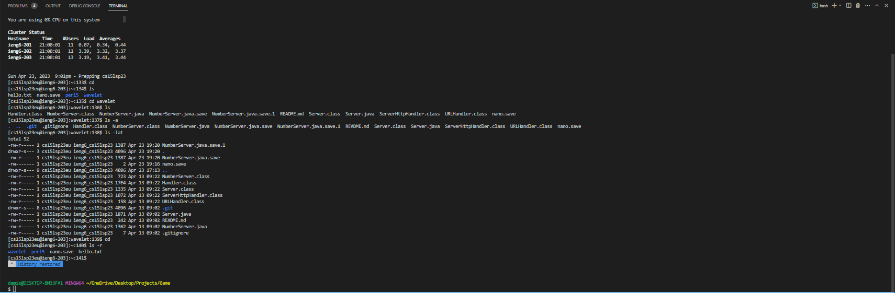

Damian Nieto  
CSE15L Thursday 8:00 am Lab  
4/6/23  

This lab report will be a tutorial on remote access. This process will be divided into 3 steps:  
      1. Installing VScode  
      2. Remotely Connecting  
      3. Trying some commands after remotely connecting  
      
---  
Step 1: Installing VScode  

In order to connect remotely, you are going to need VSCode. Use this link top download:
      [VSCode](https://code.visualstudio.com/)  
      
Now, if you're on Windows, click on the blue botton that says: **Download for Windows** (stable build)  
 
Once you click on the download button, the download will appear somewhere on your browser (In my case its at the bottom)  
It should look like this:  
 
Click on it and set up VSCode

*Note*: if you are on Mac, you are going to want to click on the drop down for the Windows download button and select the MacOS stable build option:  
  

Proceed to install and setup your VSCode on your Mac device

---  
Step 2: Remotely Connecting

Now you have VSCode. The next step is to begin the process of remotely connecting. You are going to need GitBash installed onto your device if you are running on
Windows

If you do not already have it installed, you can click on this link: [Git](https://gitforwindows.org/). Otherwise you cans skip this step. 

Go ahead and download Git and install it  

Now that you have Git installed, you can open VSCode and open up a new terminal using the Ctrl + ` command  

Your terminal should look similar to this:  

In that terminal, use the command: `$ ssh cs15lsp23zz@ieng6.ucsd.edu` to connect to the remote server  
In place of "zz", type in your the letters of your course specific account  
(In the command, do not include the "$" as this is not part of the actual command)  

When you type in that command you are likely going to be prompted with this text:  
`$ ssh cs15lsp23zz@ieng6.ucsd.edu`  
`The authenticity of host 'ieng6.ucsd.edu (128.54.70.227)' can't be established.`  
`RSA key fingerprint is SHA256:ksruYwhnYH+sySHnHAtLUHngrPEyZTDl/1x99wUQcec.`  
`Are you sure you want to continue connecting (yes/no/[fingerprint])?`  

You are going to want to type in yes since you are connecting to the server for the first time  
*Note*: If you get this message when you connect to a server you connect to often, it could mean someone is trying to listen in on or control the connection!  

After that, you will be prompted to enter a password. This password is the password to your cs15 account. If you don't know your password, you can use this link to look up your account: [https://sdacs.ucsd.edu/~icc/index.php](https://sdacs.ucsd.edu/~icc/index.php)  

Then use this link and follow the tutorial on how to reset your password: 
[reset password](https://drive.google.com/file/d/17IDZn8Qq7Q0RkYMxdiIR0o6HJ3B5YqSW/view)  
(I had to reset my password twice to get it to work!)

Once you've reset your password, wait about 5 minutes and then enter your password into the command prompt  
*Note*: You will not be able to see the text you type when inputting your password, but you are still typing 

After you've entered your password, your terminal should look something like this:  
  

Now you are connected to a remote server on your computer!  

---
Step 3: Run Some Commands  

Here are some specific commands that you can run in your terminal:  
`cd`  (The `cd` command allows you to move between directories. It typicaly takes an argument: `cd folder`. If only cd is typed, then the terminal will take you back to your home directory.)  
`ls`  (The `ls` command allows you to display the names and features of files and directories. If you use `ls` without any arguments, it will show you the names of the files/directories availabe from the current directory that you are in.   
`ls -a`  (The `ls -a` command will display all file names including hidden files starting with a ".".)  
`ls -lat`  (The `ls -lat` command will display a list of all files sorted by date.)  
`ls -r`  (The `ls -r` command will display the names of files/directories from the current directory you are in, but in the reverse order.)

This is what the commands on my end look like  

  

Notice how the first time I ran the `cd` command it didn't really do anything. That's because I was already in my home directory. And you can see you directory on the very left hand before the space where you write your command. After that I typed the command `ls` and as you can see, it showed me the files/directories that are within the current directory. As an example, I decided to cd into the "wavelet" directory by using `cd wavelet`. This took me to the wavelet directory (notice the left hand side now shows the directory with wavelet at the end). From there I used ls to display all the directories within wavelet. Then I used just `cd` to go back to my home directory and I used ls -r to show the directories inside my home directory, but in reverse order. 
--- 

Now you have learned how to remotely connect to another computer!

     
