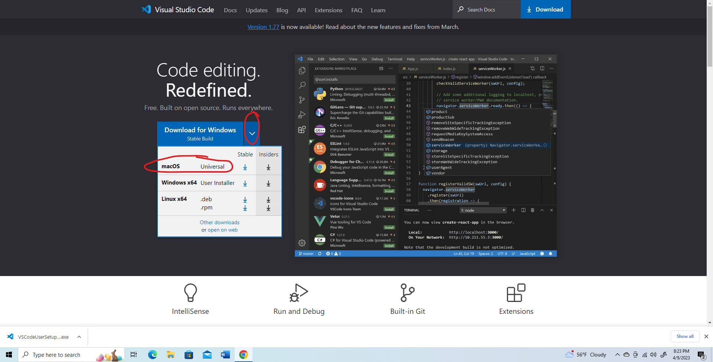

Damian Nieto  
CSE15L Thursday 8:00 am Lab  
4/6/23  

This lab report will be a tutorial on remote access. This process will be divided into 3 steps:  
      1. Installing VScode  
      2. Remotely Connecting  
      3. Trying some commands after remotely connecting  
      
---  
Step 1: Installing VScode  

In order to connect remotely, you are going to need VSCode. Use this link top download:
      [VSCode](https://code.visualstudio.com/)  
      
Now, if you're on Windows, click on the blue botton that says: **Download for Windows** (stable build)  
It should look like this:  
  
Once you click on the download button, the download will appear somewhere on your browser (In my case its at the bottom)  

Click on it and set up VSCode

*Note*: if you are on Mac, you are going to want to click on the drop down for the Windows download button and select the MacOS stable build option:  
  

Proceed to install and setup your VSCode on your Mac decive

---  
Step 2: Remotely Connecting

Now you have VSCode. The next step is to begint the process of remotely connecting. You are going to need GitBash installed onto your device  
if you are running on Windows  

If you do not already have it installed, you can click on this link: [Git](https://gitforwindows.org/). Otherwise you cans skip this step. 

Go ahead and download Git and install it  

Now that you have Git installed, you can open VSCode and open up a new terminal using the Ctrl + ` command  

In that terminal, use the command: `$ ssh cs15lsp23zz@ieng6.ucsd.edu` to connect to the remote server  
In place of "zz", type in your the letters of your course specific account  
(In the command, do not include the "$" as this is not part of the actual command)  

When you type in that command you are likely going to be prompted with this text:  
`$ ssh cs15lsp23zz@ieng6.ucsd.edu`  
`The authenticity of host 'ieng6.ucsd.edu (128.54.70.227)' can't be established.`  
`RSA key fingerprint is SHA256:ksruYwhnYH+sySHnHAtLUHngrPEyZTDl/1x99wUQcec.`  
`Are you sure you want to continue connecting (yes/no/[fingerprint])?`  

You are going to want to type in yes since you are connecting to the server for the first time  

     
