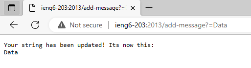
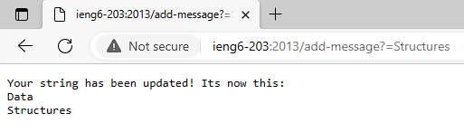

Lab Report 2  

Part 1:  

This is my code for my StringServer:  
 
    import java.io.IOException;
    import java.net.URI;

    class Handler implements URLHandler {
        String input = "";

        public String handleRequest(URI url){
            if(url.getPath().equals("/")){
                return String.format("This is your string : %s", input);
            }
            else{
                System.out.println("Path: " + url.getPath());
                if(url.getPath().contains("/add-message")){
                    String[] parameters = url.getQuery().split("=");
                    input += parameters[1] + "\n";
                    return String.format("Your string has been updated! Its now this: \n%s" , input);
                }
            }
            return "404 Not Found!";
            
        }

    }

    class StringServer{
        public static void main(String[] args) throws IOException{
            if(args.length == 0){
                System.out.println("Missing port number! Try any number between 1024 to 49141");
                return;
            }
            int port = Integer.parseInt(args[0]);

            Server.start(port, new Handler());
        }
    }  
   
This is the first screenshot of using the `/add-message` command in the String Server:  
  

For this first add-message command, the handleRequest method is called; particularly the else statement of this method. When "/add-message" is used in the command line, the URI url parameter is split by the "=" sign. The index 1 argument is the message that is added to the `String input` field that was initialized before the method. Additionally, after the string is added a new line is also added to prepare a new line for any new strings. Before the /add-message command was used, the `input` field was just an empty string. The input field was changed because it was an empty string when it was initialized and after the method call there is not a new string added to it.  

