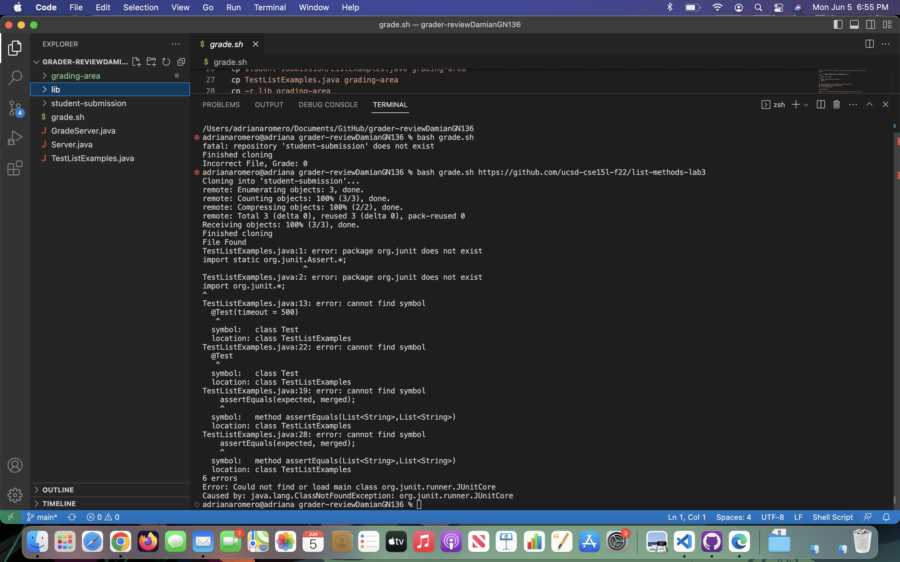
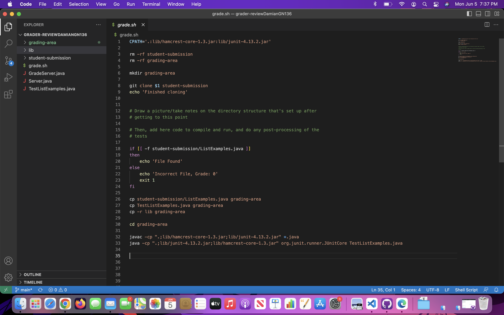

Damian Nieto
LabReport 5

Part 1:

Student Request 

What environment are you using (computer, operating system, web browser, terminal/editor, and so on)?
---
I am working on a MacBook running MacOS. I am using the Chrome browser and also using VSCode as my terminal and editor. 

Detail the symptom you're seeing. Be specific; include both what you're seeing and what you expected to see instead. Screenshots are great, copy-pasted terminal output is also great. Avoid saying “it doesn't work”.

I am experiencing trouble trying to get my auto-grader to compile. I have written the bash script and and make sure that I get all my files within the grading-area file before compiling. But I keep getting this error:




I keep getting this error that seems to have something to do with junit. This is weird to me because I am already compiling my files using the junit libraries.

Detail the failure-inducing input and context. That might mean any or all of the command you're running, a test case, command-line arguments, working directory, even the last few commands you ran. Do your best to provide as much context as you can.
---
When running the bash script, I use this commend:

bash grade.sh https://github.com/ucsd-cse15l-f22/list-methods-lab3

The bash grade.sh is to run the bash file. The git hub link is the argument that my bash script takes. It clones the file and then grades it. In this case my code just checks to see if the desired file is in the git repository. This git hub repository link is the main repository I use to test my code. 

This is my code snippet:



The weird this is that everything worked fine during lab on the lab computers when I was logged into my ieng6 account. But now on my personal mac computer it doesn't work. I would really like some help solving this issue. Thank you in advance!  

TA Response
---   

Hello! I have looked over your code. Given that your code works on your linux remote machine, your error is likely due to the differences in command synax between different operating systems. Particularly, there needs to be changes in the classpath CPATH and the command separator in the javac and java commands. On Linux, the path separator is ":" while on Mac the path separator is ";". Ands similarily, the command separator in Linux is ";" and in MacOS is ":". Based on this, my reccomendation would be to use the `uname -s` command, which retrieves the current operating system name. This way, you could use a different classpaths depending on what operating system you are using! Feel free to ask any questions!  

Results from trying TA suggestions  
---
```
adrianaromero@adriana grader-reviewDamianGN136 % bash grade.sh https://github.com/ucsd-cse15l-f22/list-methods-lab3
Cloning into 'student-submission'...
remote: Enumerating objects: 3, done.
remote: Counting objects: 100% (3/3), done.
remote: Compressing objects: 100% (2/2), done.
remote: Total 3 (delta 0), reused 3 (delta 0), pack-reused 0
Receiving objects: 100% (3/3), done.
Finished cloning
File Found
JUnit version 4.13.2
.E
Time: 0.001
There was 1 failure:
1) initializationError(org.junit.runner.JUnitCommandLineParseResult)
java.lang.IllegalArgumentException: Could not find class [TestListExamples.java]
        at org.junit.runner.JUnitCommandLineParseResult.parseParameters(JUnitCommandLineParseResult.java:100)
        at org.junit.runner.JUnitCommandLineParseResult.parseArgs(JUnitCommandLineParseResult.java:50)
        at org.junit.runner.JUnitCommandLineParseResult.parse(JUnitCommandLineParseResult.java:44)
        at org.junit.runner.JUnitCore.runMain(JUnitCore.java:72)
        at org.junit.runner.JUnitCore.main(JUnitCore.java:36)
Caused by: java.lang.ClassNotFoundException: TestListExamples.java
        at java.base/jdk.internal.loader.BuiltinClassLoader.loadClass(BuiltinClassLoader.java:641)
        at java.base/jdk.internal.loader.ClassLoaders$AppClassLoader.loadClass(ClassLoaders.java:188)
        at java.base/java.lang.ClassLoader.loadClass(ClassLoader.java:521)
        at java.base/java.lang.Class.forName0(Native Method)
        at java.base/java.lang.Class.forName(Class.java:495)
        at java.base/java.lang.Class.forName(Class.java:474)
        at org.junit.internal.Classes.getClass(Classes.java:42)
        at org.junit.internal.Classes.getClass(Classes.java:27)
        at org.junit.runner.JUnitCommandLineParseResult.parseParameters(JUnitCommandLineParseResult.java:98)
        ... 4 more

FAILURES!!!
Tests run: 1,  Failures: 1
```

After implementing the TAs suggestions, my code finally compiled. Instead of giving me the junit error, it now shows me whether the tests in the code passed or failed. In this case they failed, which just means the code my autograder is grading isn't correct. It seems the issue really was just due to the difference in command syntax between different operating systems.  


Reproducing the bug  
---
In order to reproduce the bug, you need to have 2 files that set up the Server that runs the auto-grader. In my case, Server.java and GradeServer.java. Then you also need  a file that tests the code of the files you are grading. In my case, that would be TestListExamples.java. You aso need to have the necessary junit files. After that, you should use the bash script to create a folder that contains a clone of the student sumbission file and another folder that moves all the previous files I talked about into it. In my case, the names of the files are "student-submission" and "grading-area", respectively.  

This is the bash script before the changes:  
```
CPATH='.:lib/hamcrest-core-1.3.jar:lib/junit-4.13.2.jar'

rm -rf student-submission
rm -rf grading-area

mkdir grading-area

git clone $1 student-submission
echo 'Finished cloning'


# Draw a picture/take notes on the directory structure that's set up after
# getting to this point

# Then, add here code to compile and run, and do any post-processing of the
# tests

if [[ -f student-submission/ListExamples.java ]]
then 
    echo 'File Found'
else 
    echo 'Incorrect File, Grade: 0'
    exit 1
fi

cp student-submission/ListExamples.java grading-area
cp TestListExamples.java grading-area
cp -r lib grading-area

cd grading-area

javac -cp ".;lib/hamcrest-core-1.3.jar;lib/junit-4.13.2.jar" *.java
java -cp ".;lib/junit-4.13.2.jar;lib/hamcrest-core-1.3.jar" org.junit.runner.JUnitCore TestListExamples.java
```   
The code didn't account for the cases of different operating systems and therefore produced an error with junit. This is the command I used to run my bash script, and it produces the same result regardless of what git repository you use: bash grade.sh https://github.com/ucsd-cse15l-f22/list-methods-lab3  

```
CPATH='.:lib/hamcrest-core-1.3.jar:lib/junit-4.13.2.jar'

rm -rf student-submission
rm -rf grading-area

mkdir grading-area

git clone $1 student-submission
echo 'Finished cloning'


# Draw a picture/take notes on the directory structure that's set up after
# getting to this point

# Then, add here code to compile and run, and do any post-processing of the
# tests

if [[ -f student-submission/ListExamples.java ]]
then 
    echo 'File Found'
else 
    echo 'Incorrect File, Grade: 0'
    exit 1
fi

cp student-submission/ListExamples.java grading-area
cp TestListExamples.java grading-area
cp -r lib grading-area

cd grading-area

case "$(uname -s)" in
  Linux*)   separator=":" ;;
  Darwin*)  separator=":" ;;
  CYGWIN*)  separator=";" ;;
  MINGW*)   separator=";" ;;
  *)        echo "Unsupported operating system" && exit 1 ;;
esac

javac -cp ".${separator}lib/hamcrest-core-1.3.jar${separator}lib/junit-4.13.2.jar" *.java && java -cp ".${separator}lib/junit-4.13.2.jar${separator}lib/hamcrest-core-1.3.jar" org.junit.runner.JUnitCore TestListExamples.java
```
In this edited code. Here, I changed the javac and java run commands to account for different of operating system. As the TA suggested, I used the `uname -s` command that checks for the name of the operating system being used. For a particular operating system, it will change the file and command path characters. They become arguments in the javac and java classpath that calls the junit files. This way, regardless of what operating system I run the bash script on, the auto-grader will work.  


Reflection
---

Something that I found really cool that we learned this quarter is learning how to create a web server and also how to use vim. Prior to this class I had no idea what it took to create a webserver. And although we learned to make a simple server, it gave me an idea of what exactly it looks like to build one. Its really interesting and its something that I'm actually willing to continue learning outside of this class. As for vim, I actually ran into the problem of wanting to edit files from a remote server while I was practicing for the first skill demo. I realized that I didn't know how I could edit them since those files weren't on that machine. Then the next few lectures we discussed how to do just that and I found it really really useful. I'm sure I will continue to use it all the time and it'll be a really valueable tool. 

